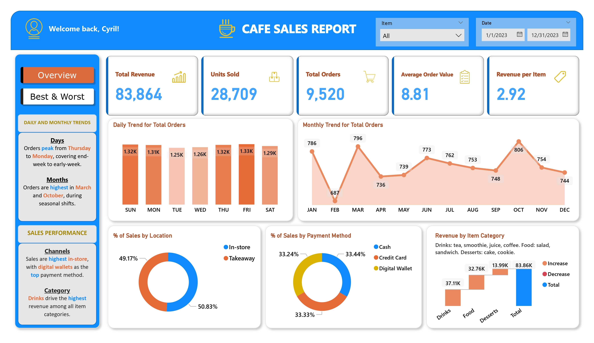
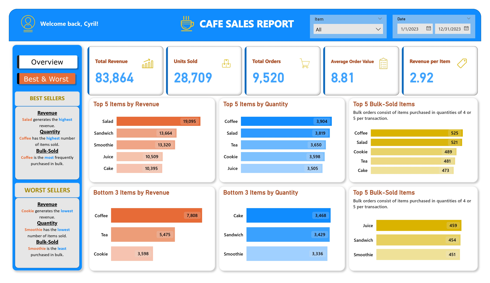

# Dirty Cafe Sales: MySQL Data Cleaning to Power BI Dashboard

This project demonstrates the process of cleaning and visualizing a 10,000-row café sales dataset using MySQL and Power BI. It involves data cleaning, transformation, and the creation of an interactive dashboard to provide insights into café sales performance.

## 🎓 Learnings

- Gain practical experience with **MySQL Workbench** for cleaning and transforming messy datasets.  
- Learn to handle **missing values, duplicates, and inconsistent data** effectively.  
- Understand **data transformation techniques**, including calculated columns and derived metrics.  
- Develop **exploratory data analysis (EDA)** skills to identify trends and patterns.  
- Build **interactive dashboards in Power BI** to visualize insights for decision-making.  
- Learn to integrate SQL-cleaned data into visualization tools efficiently.

## 📊 Project Overview

- **Dataset Source**: [Kaggle - Dirty Cafe Sales](https://www.kaggle.com/datasets/ahmedmohamed2003/cafe-sales-dirty-data-for-cleaning-training)  
- **Tools Used**:
  - **MySQL** Workbench for data cleaning and transformation
  - **Power BI** for data visualization and dashboard creation
  
### Dashboard Preview





## 🧹 Data Cleaning Steps

The dataset contained various issues such as missing values, inconsistent formats, typos, and duplicates. The following steps were undertaken to clean the data:

1. **Handling Missing Values**
   - Replaced or removed rows with missing critical information.
   - Imputed missing numerical values using mean or median where appropriate.

2. **Standardizing Formats**
   - Ensured consistent date formats across the dataset.
   - Standardized text fields (e.g., product names, locations) to maintain uniformity.

3. **Correcting Typos**
   - Identified and corrected spelling errors in categorical variables.

4. **Removing Duplicates**
   - Eliminated duplicate rows to ensure data integrity.

5. **Data Transformation**
   - Created new calculated columns (e.g., total sales) to enhance analysis.

## 📈 Power BI Dashboard

An interactive Power BI dashboard was created to visualize the cleaned data. Key features include:

- **Sales Performance Metrics**
  - Total sales, average transaction value, and sales by product category.

- **Time-Based Analysis**
  - Sales trends over time, including daily and monthly breakdowns.

- **Geographical Insights**
  - Sales distribution across different locations.

- **User Interactivity**
  - Filters and slicers to explore the data by various dimensions.

## 🗂 Repository Contents

```
dirty-cafe-sales/
│
├── datasets/                     # Original raw datasets
│ └── dirty_cafe_sales.csv         # 10,000-row raw CSV file
│
├── documentary/                           # Documented SQL scripts (not reusable, first project)
│ └── cafe_sales_documentary.sql         # MySQL queries for cleaning and analysis
│
├── reports/                         # Power BI files and exports
│ ├── cafe_sales_2023.pbix               # Power BI dashboard
│ └── cafe_sales_2023.pdf                 # PDF export of the Power BI dashboard
│
├── images/                               # Screenshots of the dashboard
│ └── dashboard_preview.png                 # Snapshot of the Power BI dashboard
│
├── LICENSE                               # MIT License file
└── README.md                             # Project overview and instructions
```

---
## 🛡️ License

This project is licensed under the [MIT License](LICENSE). You are free to use, modify, and share this project with proper attribution.

---
## 🌟 About Me

Hi! I’m Cyril Fernando, an aspiring Data Engineer and a graduate of Bulacan State University with a degree in Electrical Engineering. I focus on building data solutions, exploring analytics, and applying engineering principles to address real-world challenges. This repository presents my work in data engineering, SQL, and analytics projects as part of my continuous learning and professional growth.

I welcome connections with professionals and peers in the data community. You can reach me through the following platforms:

[](https://www.linkedin.com/in/cyfernando)   
[](mailto:cyriljamesbfernando0208@gmail.com)
